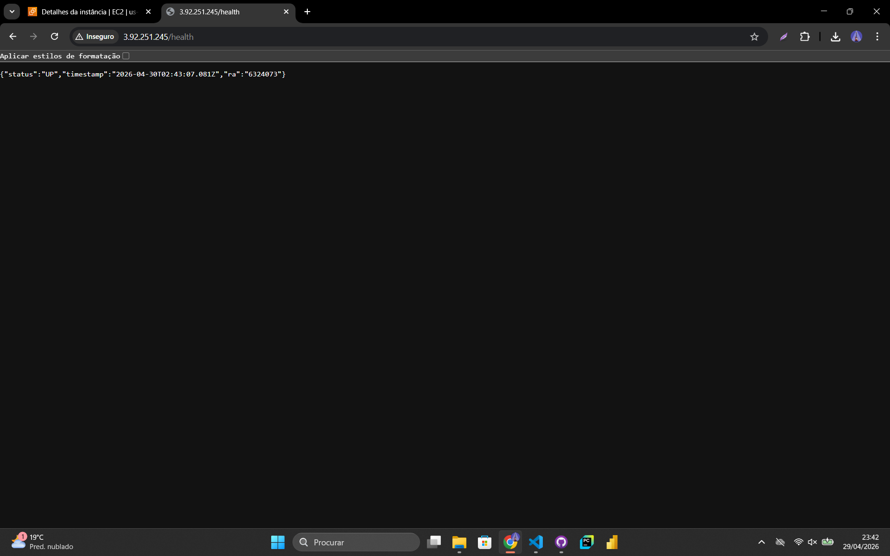

# TF09 - Portfólio Pessoal na AWS

## Aluno
- **Nome:** [Leonardo Frazão Sano]
- **RA:** 6324073

## Visão Geral
Este projeto consiste no deploy de uma aplicação Full Stack (Frontend Nginx + Backend Node.js) em uma instância EC2 na AWS, utilizando uma infraestrutura de rede segura com VPC customizada, subnets públicas e privadas, e Security Groups restritivos.

## link de Acesso
- **Aplicação:** [http://3.92.251.245](http://3.92.251.245)
- **Health Check:** [http://3.92.251.245/health](http://3.92.251.245/health)

## Arquitetura de Rede
A arquitetura segue as melhores práticas da AWS conforme os requisitos do TF09:
- **VPC Customizada**: `11.0.0.0/16` (ID: `vpc-01bd40a2594a27198`)
- **Public Subnet**: `11.0.1.0/24` (ID: `subnet-0dea0eeb5898623a1`)
- **Internet Gateway**: Conectado e roteado para a Subnet Pública.
- **Security Group**: `TF09-web-sg-6324073` (ID: `sg-078c4a861f8709a33`)
  - **Porta 80 (HTTP)**: Aberta para o mundo (`0.0.0.0/0`).
  - **Porta 22 (SSH)**: Aberta para administração remota.

## Tecnologias Utilizadas
- **AWS CLI**: Provisionamento automatizado da infraestrutura de rede.
- **Docker & Docker Compose**: Containerização das camadas de Frontend e Backend.
- **Nginx**: Servidor web e proxy reverso para a API.
- **Node.js**: API REST para gestão do portfólio.
- **Amazon Linux 2023**: Sistema operacional da instância EC2.

## Como Executar
1. Configure as credenciais AWS via `aws configure`.
2. Provisione a rede utilizando os comandos de infraestrutura contidos em `infrastructure/`.
3. Lance uma instância EC2 na VPC e Subnet criadas.
4. Conconecte via SSH, instale o Docker e execute `docker-compose up -d`.

## Segurança Implementada
- **Isolamento de Rede**: Uso de VPC dedicada em vez da padrão.
- **Menor Privilégio**: Security Group configurado apenas com as portas necessárias.
- **Proxy Reverso**: Nginx protegendo o acesso direto ao container do Backend.

## Custos Estimados
- **EC2 t3.micro**: Grátis no Free Tier (limitado a 750h/mês).
- **Tráfego de Dados**: Grátis dentro dos limites do Free Tier.
- **Armazenamento (EBS)**: Grátis até 30GB.

## Evidências de Funcionamento

### 1. Aplicação Online

### 2. Health Check

### 3. Instância AWS (Running)

### 4. Containers Docker

